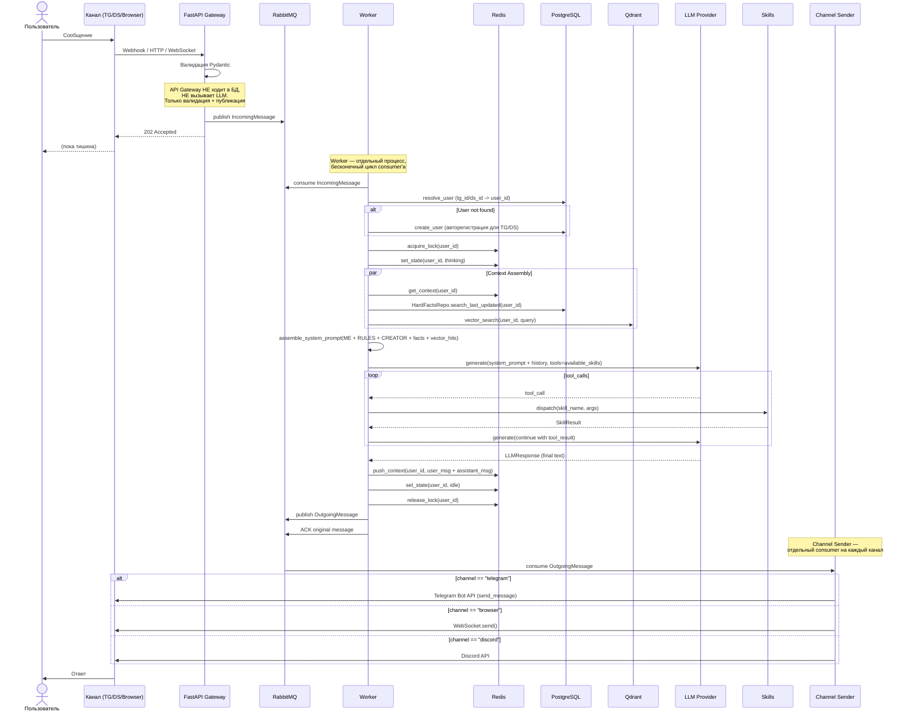
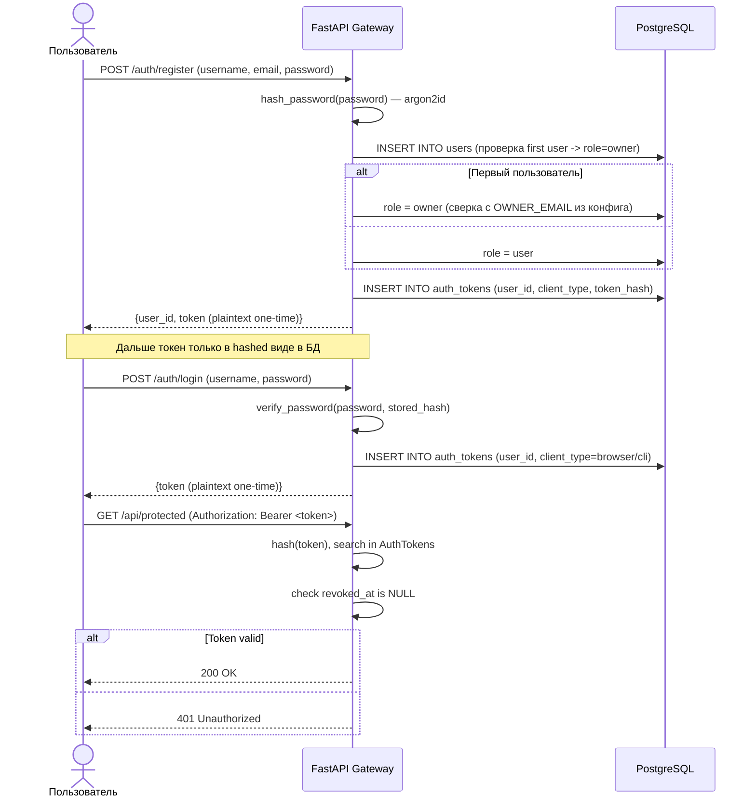
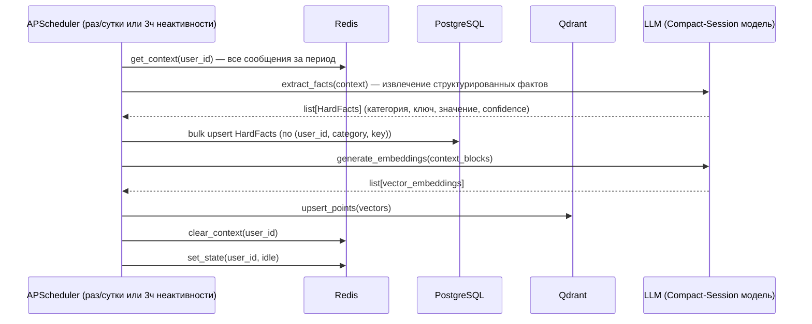
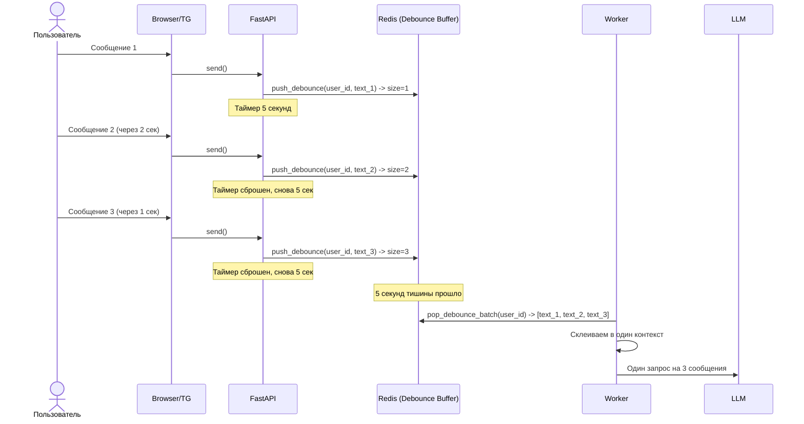
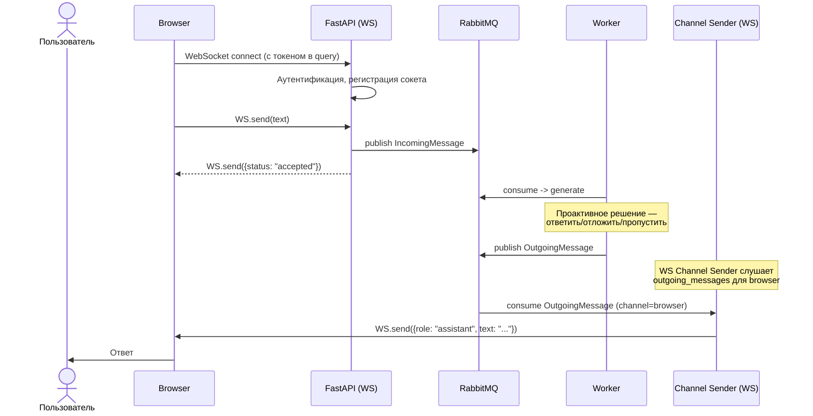

# Архитектура Nodya — полное описание

> Версия: 1.0
> Статус: черновик (проект на этапе инициализации)

---

## 1. Концепция

**Nodya** — персональный ИИ-ассистент с многоканальным доступом (Telegram, Discord, браузер, CLI), модульной архитектурой, многоуровневой памятью и системой навыков (skills) с градацией прав доступа. 

Система спроектирована как два независимых слоя, общающихся исключительно через RabbitMQ:
- **API Gateway (FastAPI)** — принимает входящие запросы (webhook, WebSocket, REST), валидирует, публикует в очередь `incoming_messages`, отвечает `202 Accepted`. Больше ничего не делает.
- **Worker** — отдельный процесс (или процесс в том же контейнере, но независимый). Подписан на `incoming_messages`, выполняет всю логику: память, LLM, skills. Результат публикует в `outgoing_messages`.
- **Channel Senders** — легковесные consumer'ы (по одному на канал), подписанные на `outgoing_messages`. Фильтруют по `channel` и отправляют пользователю через соответствующий API (Telegram Bot API, WebSocket, Discord API).

Никакого прямого взаимодействия между Worker и HTTP-слоем. Только через RabbitMQ.

### Ключевые принципы

| Принцип | Описание |
|---|---|
| **Self-hosted multi-tenant** | Каждый разворачивает экземпляр для себя/команды. Пользователи внутри одного деплоя изолированы по `user_id` |
| **Асинхронность везде** | `asyncio` на всём стеке: FastAPI, SQLAlchemy async, `aio-pika`, `redis.asyncio` |
| **Message-driven** | Единый пайплайн через RabbitMQ. API Gateway не ждёт ответа LLM — `202 Accepted` сразу |
| **Proactive-first** | Нодя может инициировать диалог сама (RSS, фон) в любом канале. Worker публикует `OutgoingMessage` в `outgoing_messages`, Channel Sender доставляет в TG/DS/Browser/CLI |
| **Debounce-буферизация** | Сообщения пользователя накапливаются 5 секунд перед отправкой LLM. Один запрос на пачку, а не N запросов на N сообщений |
| **Fail-fast при старте** | Bootstrap проверяет доступность всех сервисов (PG, Redis, RabbitMQ, Qdrant) перед открытием соединений |
| **Безопасность на уровне кода, не промптов** | Права на skills проверяются в коде `SkillRegistry`, а не в `RULES.md`. LLM можно обмануть |
| **Логирование на service, не на repository** | Ошибки логируются в service/бизнес-слое. Repository слой — исключительно доступ к данным, без логирования |

---

## 2. Технологический стек

| Компонент | Технология | Назначение |
|---|---|---|
| **API Gateway** | FastAPI + Uvicorn | HTTP-эндпоинты (webhook, auth, health) |
| **База данных** | PostgreSQL 16 + asyncpg | Long-term memory (users, facts, audit, auth) |
| **ORM** | SQLAlchemy 2.0 (async) | Доступ к БД, Alembic для миграций |
| **Миграции** | Alembic (async) | Версионирование схемы БД |
| **Кэш/состояния** | Redis 8 | Short-term memory (state, context, lock, debounce, presence) |
| **Брокер сообщений** | RabbitMQ | Message queue (incoming, outgoing, agent commands) |
| **Векторное хранилище** | Qdrant | Semantic search для RAG |
| **LLM (primary)** | Google AI Studio (Gemini 2.0 Flash/Pro) | Генерация ответов, эмбеддинги, tool calling |
| **LLM (fallback)** | OpenRouter | Резервный провайдер при недоступности Gemini |
| **HTTP-клиент** | httpx (async) | Запросы к внешним API (LLM, Telegram, RSS) |
| **Планировщик** | APScheduler | Фоновые задачи (consolidation, background parser) |
| **Хэширование паролей** | argon2-cffi | Argon2id для паролей и токенов |
| **Конфигурация** | Pydantic Settings | .env + типизированные настройки |
| **Логирование** | Кастомный логгер (stdout + JSONL) | Консоль (цветной) + файловые ротации в JSONL |

---

## 3. Структура проекта (целевая)

```
nodya/
├── app/                          # Nodya Core — деплоится на сервер
│   ├── core/                     # Config, logger
│   │   ├── config.py             # Pydantic Settings (SettingsSchema)
│   │   ├── logger.py             # get_logger(), LoggerMixin
│   │   ├── logger_config.py      # setup_logging(), форматтеры
│   │   └── __init__.py           # re-export
│   │
│   ├── api/                      # API Gateway (только incoming)
│   │   ├── chats/                # Точки входа от каналов
│   │   │   ├── tg/               # Telegram: POST /webhook
│   │   │   ├── ds/               # Discord: interactions endpoint (после MVP)
│   │   │   ├── browser/          # Browser: POST /api/send
│   │   │   └── cli/              # CLI: POST /api/send (после MVP)
│   │   ├── ws.py                 # WebSocketManager + WS endpoint /ws
│   │   ├── auth/                 # Регистрация, логин, токены
│   │   ├── health.py             # GET /health
│   │   └── deps.py               # FastAPI dependencies
│   │
│   ├── brain/                    # "Мозг" — используется Worker'ом
│   │   ├── models/               # SQLAlchemy модели
│   │   ├── repositories/         # Data access layer
│   │   ├── sqlite_files/         # SQLite-файлы для dev/тестов (опционально)
│   │   ├── memory/               # short (Redis), long (PG), vector (Qdrant), prompts
│   │   ├── llm_choice/           # LLM providers + router
│   │   ├── skills/               # Skill registry + sandbox
│   │   └── migrations/           # Alembic
│   │
│   ├── worker.py                 # Worker — главный脑: consumer incoming_messages
│   ├── senders/                  # Channel Senders — доставка ответов
│   │   ├── base.py               # Abstract ChannelSender
│   │   ├── tg_sender.py          # Telegram: aiogram Bot API
│   │   ├── browser_sender.py     # Browser: WebSocketManager
│   │   ├── ds_sender.py          # Discord: REST API (после MVP)
│   │   └── cli_sender.py         # CLI: (после MVP)
│   ├── common/                   # Shared types
│   │   └── schemas.py            # IncomingMessage, OutgoingMessage, etc.
│   └── main.py                   # Точка входа для FastAPI (только API Gateway)
│
├── agent/                        # Nodya Agent (опционально)
│   ├── main.py
│   ├── consumer.py
│   ├── skills/
│   └── pyproject.toml
│
├── shared/                       # SkillRequest/SkillResult для RPC
│   └── schemas.py
│
├── tests/
├── docs/
├── logs/
├── Dockerfile
├── docker-compose.yml
├── pyproject.toml
```

---

## 4. Поток данных (User Flow)

### 4.1 Основной цикл — сообщение пользователя



### 4.2 Регистрация и аутентификация (browser/cli)



### 4.3 Consolidation (фаза сна)



### 4.4 Bootstrap (старт приложения)

```
docker-compose up
    │
    ├──> PostgreSQL healthcheck (pg_isready)
    ├──> Redis healthcheck (redis-cli ping)
    ├──> RabbitMQ healthcheck (amqp-client)
    ├──> Qdrant healthcheck (HTTP /healthz)
    │
    ├──> FastAPI Gateway стартует:
    │    ├── setup_logging()
    │    ├── alembic upgrade head
    │    ├── WebSocketManager.init()
    │    ├── MessagePublisher.connect() — соединение с RabbitMQ
    │    └── uvicorn.run() — HTTP + WS endpoints
    │
    ├──> Worker стартует (отдельный процесс):
    │    ├── SkillRegistry.register() — регистрация всех скиллов
    │    ├── Подписка на очередь incoming_messages
    │    └── Бесконечный цикл: consume -> handle -> ACK
    │
    └──> Channel Senders стартуют (по одному на канал):
         ├── TG Sender: подписка на outgoing_messages, фильтр channel=telegram
         ├── Browser Sender: подписка на outgoing_messages, фильтр channel=browser
         ├── DS Sender: подписка на outgoing_messages, фильтр channel=discord
         └── CLI Sender: подписка на outgoing_messages, фильтр channel=cli
```

---

### 4.5 Debounce (буферизация сообщений)

Когда пользователь печатает несколько сообщений подряд, они не должны вызывать N запросов к LLM. Вместо этого — паттерн Debounce:



**Логика Debounce:**
1. Сообщение попадает в буфер (Redis List `nodya:debounce:{user_id}`)
2. Если буфер был пуст — запускается таймер 5 секунд
3. Если пришло новое сообщение — таймер сбрасывается
4. По истечении таймера — батч забирается целиком и уходит в Worker
5. Worker склеивает сообщения в один контекст и отправляет LLM

### 4.6 Proactive Flow (инициатива Ноди)

Нодя может не только отвечать, но и сама решать — отвечать ли, когда ответить, и стоит ли начинать диалог.

```
Сообщение от пользователя
    │
    ├──> Проверка state
    │    ├── thinking → поставить в очередь, ждать освобождения
    │    └── idle → проверка контекстного окна
    │
    ├──> Проверка контекстного окна
    │    ├── мало сообщений → debounce буфер (5с)
    │    └── много за раз → debounce буфер (5с)
    │
    ├──> Свободна?
    │    ├── Да → ответить сейчас
    │    └── Нет → подкинуть монетку
    │         ├── решила ответить → ответить
    │         └── решила не отвечать → запланировать через рандом <= 2ч
    │
    └──> Фоновый парсер RSS
         ├── Score > 8 → сформировать сообщение → outgoing_messages
         └── Score средний → сохранить выжимку в Qdrant
```

**Три сценария проактивного поведения:**

| Сценарий | Триггер | Действие |
|---|---|---|
| **Ответить/не ответить** | Сообщение пользователя | Если Нодя "не в настроении" (рандом + контекст) — ответ может быть отложен до 2 часов |
| **Запланировать ответ** | Сообщение пользователя | Ответ уходит в `outgoing_messages` с `delay_until`. Consumer проверяет timestamp перед отправкой |
| **Инициировать диалог** | Background Parser (RSS) | Если найдена супер-релевантная новость (score > 8) — Нодя сама пишет пользователю |

### 4.7 WebSocket для browser-клиента (проактивная отправка)

Для browser-клиента HTTP не подходит для проактивной отправки (сервер не может сам инициировать HTTP-запрос клиенту). Решение — WebSocket-соединение.

**WebSocketManager (`app/api/ws.py`):**
```python
class WebSocketManager:
    """Управляет WebSocket-соединениями browser-клиентов."""
    
    async def connect(self, user_id: UUID, ws: WebSocket):
        """Сохранить сокет в мапу {user_id: list[ws]}."""
    
    async def disconnect(self, user_id: UUID, ws: WebSocket):
        """Удалить сокет."""
    
    async def send_to_user(self, user_id: UUID, message: OutgoingMessage):
        """Отправить сообщение через открытый сокет пользователя."""
    
    async def broadcast_to_user(self, user_id: UUID, message: OutgoingMessage):
        """Отправить всем сокетам пользователя (если несколько вкладок)."""
```

**Flow проактивной отправки через WebSocket:**



**WebSocket endpoint:** `GET /ws?token=<auth_token>` — при подключении аутентификация, затем обмен.

---

## 5. Компоненты и их обязанности

### 5.1 Core (`app/core/`)

| Файл | Ответственность |
|---|---|
| `config.py` | `SettingsSchema` — все переменные окружения с типизацией. `computed_field` для `postgres_url`, `redis_url` |
| `logger.py` | `get_logger(name)` — получить логгер с префиксом `nodya`. `LoggerMixin` — для классов |
| `logger_config.py` | `setup_logging()` — инициализация корневого логгера: цветной console handler + JSONL file handler |

### 5.2 API Gateway (`app/api/`) — только приём и валидация

**Важно:** API Gateway НЕ взаимодействует с базой данных, НЕ вызывает LLM, НЕ исполняет скиллы. Его единственная задача — принять запрос, провалидировать, опубликовать в RabbitMQ и ответить `202 Accepted`.

| Компонент | Методы | Назначение |
|---|---|---|
| `chats/tg/` | `POST /webhook` | Приём webhook от Telegram. Валидация через Pydantic (модель Telegram Update). Публикация `IncomingMessage`. Ответ `202 Accepted` |
| `chats/browser/` | `POST /api/chats/browser/send` | Отправка сообщения от browser-клиента (требует токен). Публикация `IncomingMessage` |
| `chats/browser/` | `GET /ws?token=<token>` | WebSocket для browser: отправка сообщений + получение ответов |
| `ws.py` | `WebSocketManager` | Менеджер WebSocket-соединений: connect/disconnect/отправка |
| `auth/` | `POST /auth/register` | Регистрация (username, email, password) -> Users + AuthTokens |
| `auth/` | `POST /auth/login` | Логин (username, password) -> AuthTokens |
| `health.py` | `GET /health` | Проверка всех внешних сервисов (PG, Redis, RabbitMQ, Qdrant) |
| `deps.py` | `get_current_user` | Dependency: хэш токена из `Authorization: Bearer` -> поиск в `AuthTokens` -> возврат `Users` |

### 5.3 Channel Senders — доставка ответов пользователю

Отдельные consumer'ы (по одному на канал), подписанные на очередь `outgoing_messages`. Каждый фильтрует по `channel` и отправляет через соответствующий API.

| Компонент | Очередь | Фильтр | Назначение |
|---|---|---|---|
| `TG Sender` | `outgoing_messages` | `channel == "telegram"` | Отправка через Telegram Bot API (`aiogram.Bot.send_message`) |
| `Browser Sender` | `outgoing_messages` | `channel == "browser"` | Отправка через WebSocket (`WebSocketManager.send_to_user`) |
| `DS Sender` | `outgoing_messages` | `channel == "discord"` | Отправка через Discord API (после MVP) |
| `CLI Sender` | `outgoing_messages` | `channel == "cli"` | Отправка через CLI (после MVP) |

Каждый Sender — отдельный asyncio Task, который может быть запущен в том же контейнере, что Worker, или вынесен отдельно.

### 5.4 Worker (`app/worker.py`)

**Worker — отдельный процесс (не asyncio Task внутри FastAPI).** 
Запускается параллельно с API Gateway. Единственный способ коммуникации — RabbitMQ.

```python
class Worker:
    """
    Бесконечный цикл: consume -> handle -> ACK.
    Не имеет доступа к HTTP, не имеет прямого доступа к клиентам.
    """

    -run()  # Запуск consumer на incoming_messages
    -handle_message(msg)  # Полный lifecycle сообщения:
    #   1. resolve_user (по tg_id/ds_id — поиск или создание)
    #   2. debounce: pop_debounce_batch(user_id)
    #   3. acquire_lock(user_id)
    #   4. set_state(user_id, thinking)
    #   5. build_context(user_id) — Redis + PG + Qdrant
    #   6. proactive_decision() — ответить/отложить/пропустить
    #   7. assemble_system_prompt(user, context)
    #   8. LLM generate(tools)
    #   9. tool_calls loop
    #   10. publish OutgoingMessage
    #   11. release_lock(user_id)
    #   12. ACK
    -resolve_user(ch, id)  # Поиск/создание пользователя в БД
    -build_context(uid)  # Параллельный сбор контекста
    -proactive_decision()  # Решение: отвечать/отложить/пропустить
    -assemble_system_prompt(user, context)
```

### 5.4 LLM-слой (`app/brain/llm_choice/`)

```python
class LLMProvider(ABC):
    """Абстрактный провайдер LLM."""

    @abstractmethod
    async def generate(
        self, prompt: str, tools: list[ToolSpec] | None = None
    ) -> LLMResponse: ...


class GeminiProvider(LLMProvider):
    """Google AI Studio Gemini API."""


class OpenRouterProvider(LLMProvider):
    """OpenRouter API (fallback)."""


class LLMRouter:
    """
    Маршрутизация по 4 ролям (из tldraw-заметок):

    Роль D (Dialogue) — "Good нейросети"
        Модель: Gemini 3.5 Flash (primary) / Gemini 3.1 Flash Lite (fallback)
        Назначение: Основной диалог с пользователем. Быстрый ответ, tool calling

    Роль CS (Compact-Session / Sleep) — "Best нейросети"
        Модель: Gemini 3.6 Flash
        Назначение: Извлечение фактов из контекста, компрессия памяти,
                    consolidation. Медленнее, но точнее — "спит" и анализирует

    Роль BP (Background-Parser) — "Local || free"
        Модель: Gemma 4 (31B|26B) через OpenRouter (free tier)
        Назначение: Парсинг RSS/TG-каналов, фильтр релевантности.
                    Не требует высокой точности, важна бесплатность/локал

    Роль VS (Vector-Search) — "Embedding models"
        Модель: Gemini Embedding 2 / OpenRouter embedding API
        Назначение: Перевод текста в векторные эмбеддинги для Qdrant

    Fallback: При недоступности primary -> OpenRouter (тот же уровень модели)
    """
```

### 5.5 Память

**Short-term (Redis) — `app/brain/memory/short/redis.py`:**

```
Ключи Redis:
  nodya:state:{user_id}          Hash  — status, last_active_at
  nodya:context:{user_id}        List  — Capped (N последних сообщений, TTL 24ч)
  nodya:lock:{user_id}           String — SET NX EX (владелец лога)
  nodya:debounce:{user_id}       List  — Буфер сообщений (таймер 5с)
  nodya:agent_online:{user_id}    String — Presence Agent (TTL 15с)
```

**Long-term (PostgreSQL) — `app/brain/memory/long/database.py`:**

- Пул соединений: pool_size=20, max_overflow=10
- expire_on_commit=False (чтобы можно было читать объекты после коммита)
- `get_db()` — async generator для FastAPI dependency

**Vector (Qdrant) — будет добавлен:**

- Коллекции: `nodya_memory` — точки с `user_id` как payload-фильтром
- Эмбеддинги через LLM Provider (Google AI Studio embedding API)

### 5.6 Skills

```python
@dataclass
class SkillDefinition:
    name: str
    description: str
    tier: Literal["safe", "elevated", "sandboxed", "system"]
    input_schema: type[BaseModel]
    handler: Callable[..., Awaitable[SkillResult]]


class SkillRegistry:
    """
    - register(skill)              # Регистрация skills на старте
    - list_available(user, deploy) # Фильтр по роли + настройкам деплоя
    - dispatch(user, deploy, name, args)  # Проверка прав + вызов + аудит
    """
```

| Tier | Доступ | Исполнение | Примеры |
|---|---|---|---|
| `safe` | Всегда | In-process | Диалог, чтение памяти, RSS |
| `elevated` | Всегда (в рамках своего `user_id`) | In-process | Чтение/запись своих данных |
| `sandboxed` | Если `deployment.sandbox_enabled` | Docker контейнер (--network none, read-only) | Запуск кода "в песочнице" |
| `system` | `user.role == owner` + `deployment.system_skills_enabled` | Nodya Agent (отдельный процесс) | Shell, файлы, процессы |

---

## 6. Модели данных (целевые после фиксов)

### Users

| Колонка | Тип | Ограничения | Назначение |
|---|---|---|---|
| `user_id` | `UUID` | PK, default uuid4 | Внутренний идентификатор |
| `telegram_id` | `BigInteger` | nullable | Внешний ID от Telegram |
| `discord_id` | `BigInteger` | nullable | Внешний ID от Discord |
| `username` | `String(20)` | NOT NULL | Логин для browser/cli |
| `passwd_hash` | `String` | NOT NULL | Argon2id хэш пароля |
| `role` | `String` | Literal["owner", "user"] | Роль в системе |
| `settings` | `JSONB` | default={} | Настройки пользователя |
| `created_at` | `DateTime(tz)` | server_default=now() | Дата создания |

### AuthTokens

| Колонка | Тип | Ограничения | Назначение |
|---|---|---|---|
| `token_id` | `Integer` | PK, autoincrement | Внутренний ID токена |
| `user_id` | `UUID` | FK -> users.user_id, NOT NULL | Владелец токена |
| `client_type` | `String` | Literal["browser", "cli"] | Тип клиента |
| `token_hash` | `String` | NOT NULL | Argon2id хэш токена |
| `created_at` | `DateTime(tz)` | server_default=now() | Дата создания |
| `last_used_at` | `DateTime(tz)` | nullable | Последнее использование |
| `revoked_at` | `DateTime(tz)` | nullable | Дата отзыва (NULL = активен) |

### HardFacts

| Колонка | Тип | Ограничения | Назначение |
|---|---|---|---|
| `fact_id` | `Integer` | PK, autoincrement | ID факта |
| `user_id` | `UUID` | FK -> users.user_id | Владелец факта |
| `category` | `String` | NOT NULL | Категория (preferences, work, ...) |
| `key` | `String` | NOT NULL | Ключ (name, job_title, ...) |
| `value` | `JSONB` | NOT NULL, default={} | Значение |
| `confidence` | `Float` | NOT NULL | Уверенность (0.0 - 1.0) |
| `updated_at` | `DateTime(tz)` | server_default=now(), onupdate=now() | Последнее обновление |

### AuditLogs

| Колонка | Тип | Ограничения | Назначение |
|---|---|---|---|
| `log_id` | `Integer` | PK, autoincrement | ID записи |
| `user_id` | `UUID` | FK -> users.user_id | Кто вызвал |
| `tool_name` | `String` | NOT NULL | Название скилла |
| `arguments` | `JSONB` | NOT NULL | Аргументы вызова |
| `status` | `String` | NOT NULL | "success", "error", "denied" |
| `created_at` | `DateTime(tz)` | server_default=now() | Когда |

---

## 7. Принятые архитектурные решения (ADR)

### ADR-1: Qdrant вместо pgvector
- **Контекст:** Нужно векторное хранилище для RAG. В заметках (User Flow) изначально рекомендовался pgvector как "идеальный prod-ready паттерн", а Qdrant/Milvus — "оверинжиниринг". В более поздних заметках (DATABASE) Qdrant отмечен как выбранное решение, pgvector — "Костыль X"
- **Решение:** Qdrant как отдельный сервис в docker-compose
- **Обоснование:** Qdrant даёт лучший перформанс для семантического поиска, native поддержку фильтрации по payload (user_id). Не нагружает PostgreSQL. Отдельное масштабирование. pgvector — вариант для случаев, когда нельзя поднять ещё один сервис
- **Статус:** Принято (с возможностью переключения на pgvector через конфиг в будущем)

### ADR-2: Self-hosted multi-tenant (не SaaS)
- **Контекст:** Модель распространения — каждый сам разворачивает
- **Решение:** Multi-tenant в рамках одного инстанса с ролями owner/user
- **Обоснование:** Соответствует модели "развернул для себя/команды". Owner может дать доступ другим пользователям того же деплоя

### ADR-3: Opaque-токены вместо JWT
- **Контекст:** Аутентификация для browser/cli
- **Решение:** Argon2id-хэш токена хранится в БД, plaintext отдаётся один раз
- **Обоснование:** Монолит с одним инстансом — stateless-верификация не нужна. Хэш в БД даёт мгновенный отзыв токена без blacklist'ов

### ADR-4: RabbitMQ как единственный транспорт
- **Контекст:** Communication между API Gateway, Worker и Agent
- **Решение:** Всё через RabbitMQ (incoming, outgoing, agent_commands)
- **Обоснование:** Единый надёжный брокер. ACK/NACK, DLQ, RPC-паттерн — всё из коробки

### ADR-5: Один Worker + Redis Lock
- **Контекст:** Параллельная обработка сообщений
- **Решение:** Один процесс Worker внутри того же контейнера. Redis lock для исключения гонок
- **Обоснование:** Для MVP не нужно масштабирование. Redis lock — дешёвый и надёжный способ гарантировать, что одно сообщение не обрабатывается дважды

### ADR-6: LLM Provider через абстракцию с fallback
- **Контекст:** Вызов LLM — критическая зависимость
- **Решение:** Abstract base class `LLMProvider` -> `GeminiProvider` (primary) + `OpenRouterProvider` (fallback), `LLMRouter` управляет выбором
- **Обоснование:** Gemini — бесплатный tier, высокая скорость. OpenRouter — резерв при недоступности. Единый интерфейс позволяет добавить любого провайдера

### ADR-7: Embedding через API провайдера, не локально
- **Контекст:** Для векторного поиска нужны эмбеддинги
- **Решение:** Использовать embedding-API Gemini/OpenRouter, не поднимать отдельную модель
- **Обоснование:** Меньше расход памяти, проще деплой, размер Docker-образа меньше

### ADR-8: Проверка прав на skills в коде, не в промптах
- **Контекст:** Безопасность system-level скиллов
- **Решение:** `SkillRegistry.dispatch()` выполняет проверку прав ДО вызова handler. `RULES.md` — подсказка для LLM, не граница безопасности
- **Обоснование:** LLM можно обмануть user-сообщением. Код — единственная надёжная граница

### ADR-9: Agent как отдельный процесс, не in-process
- **Контекст:** Host-level операции (shell, fs, автоматизация)
- **Решение:** Отдельный процесс `agent/` со своими зависимостями, RPC через RabbitMQ
- **Обоснование:** Core не должен тащить зависимости для host-операций. Agent работает на машине owner'а, может быть даже не в том же Docker

### ADR-10: Capped List в Redis для short-term памяти
- **Контекст:** Хранение последних N сообщений диалога
- **Решение:** Redis List с LTRIM (capped до N элементов) + TTL 24ч
- **Обоснование:** Проще и быстрее, чем PostgreSQL для rolling window. Автоматическое устаревание через TTL

### ADR-11: Логирование на service-слое, repository не логирует
- **Контекст:** Где логировать ошибки — в repository или service/business layer
- **Решение:** Логировать только на уровне service (бизнес-логика). Repository слой — исключительно операции с данными, логов не пишет
- **Обоснование:** Repository — чистая абстракция данных, логи в нём создают шум и дублирование. Service слой владеет контекстом операции и может записать осмысленное сообщение об ошибке
- **Статус:** Принято

---

## 8. Конфигурация (Settings)

```python
# app/core/config.py
class SettingsSchema(BaseSettings):
    # --- Логирование ---
    LOG_LEVEL: str = "DEBUG"

    # --- PostgreSQL ---
    POSTGRES_HOST: str = "localhost"
    POSTGRES_PORT: int = 5434
    POSTGRES_USER: str = "postgres"
    POSTGRES_PASSWORD: str = "postgres"
    POSTGRES_DB: str = "postgres"
    POSTGRES_ASYNCPG: str = "asyncpg"  # драйвер

    # --- Redis ---
    REDIS_HOST: str = "localhost"
    REDIS_PORT: int = 6381

    # --- RabbitMQ ---
    RABBITMQ_HOST: str = "localhost"
    RABBITMQ_PORT: int = 5672
    RABBITMQ_USER: str = "guest"
    RABBITMQ_PASSWORD: str = "guest"

    # --- Qdrant ---
    QDRANT_HOST: str = "localhost"
    QDRANT_PORT: int = 6333

    # --- LLM ---
    GEMINI_API_KEY: str = ""
    OPENROUTER_API_KEY: str = ""

    # --- Telegram ---
    TELEGRAM_BOT_TOKEN: str = ""
    TELEGRAM_WEBHOOK_URL: str = ""

    # --- Skills ---
    SYSTEM_SKILLS_ENABLED: bool = False
    SANDBOX_ENABLED: bool = True

    # --- Owner ---
    OWNER_EMAIL: str = (
        ""  # Первый зарегистрировавшийся с этим email получает role=owner
    )

    @computed_field
    @property
    def postgres_url(self) -> str: ...

    @computed_field
    @property
    def redis_url(self) -> str: ...

    @computed_field
    @property
    def rabbitmq_url(self) -> str: ...
```

---

## 9. Обработка ошибок и надёжность

| Сценарий | Поведение |
|---|---|
| LLM timeout/ошибка | Fallback на OpenRouter (если и он упал — NACK сообщения, лог, DLQ) |
| PostgreSQL недоступен | Healthcheck не проходит -> fail-fast при bootstrap. В рантайме — NACK + retry |
| Redis недоступен | Lock не взять -> сообщение остаётся в очереди. Worker падает с ошибкой |
| RabbitMQ недоступен | API Gateway не может опубликовать -> 503 Service Unavailable |
| Qdrant недоступен | Worker продолжает без векторного поиска (degraded mode), лог ошибки |
| Graceful shutdown | SIGTERM -> stop consuming -> таймаут 30с на текущие задачи -> закрытие пулов |
| Некорректный токен | 401 Unauthorized с общей формулировкой (не уточнять, что именно не так) |

---

## 10. Тестирование

| Уровень | Инструмент | Что тестируем |
|---|---|---|
| Unit | pytest + pytest-asyncio | Репозитории (in-memory SQLite или мок AsyncSession), сервисы (passwd), хэлперы |
| Integration | pytest + testcontainers | Модели + реальная БД (поднятый PostgreSQL), Redis, RabbitMQ |
| API | httpx (AsyncClient) | Эндпоинты FastAPI (с моками внешних сервисов) |
| E2E | — | Ручное тестирование через Telegram-бота |

---

## 11. Диаграмма зависимостей (пакеты Python)

```
fastapi + uvicorn       # API Gateway
aiogram                 # Telegram Bot API клиент
aio-pika                # RabbitMQ (async)
asyncpg                 # PostgreSQL driver
sqlalchemy[asyncio]     # ORM
alembic                 # Миграции
redis[hiredis]          # Redis (async)
qdrant-client           # Qdrant client
pydantic + pydantic-settings  # Валидация + конфиг
httpx                   # HTTP-клиент для LLM/RSS
apscheduler             # Фоновые задачи
argon2-cffi             # Хэширование
pytest + pytest-asyncio # Тесты
ruff                    # Линтер
```
