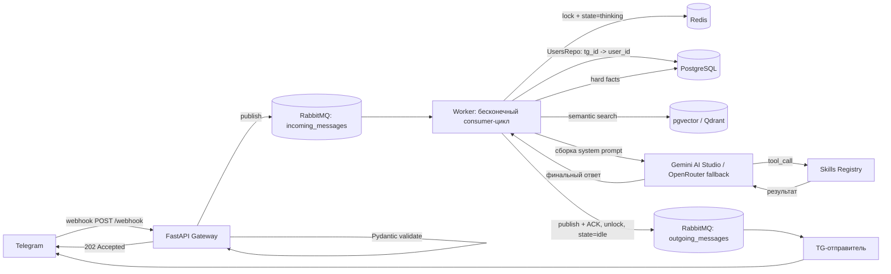
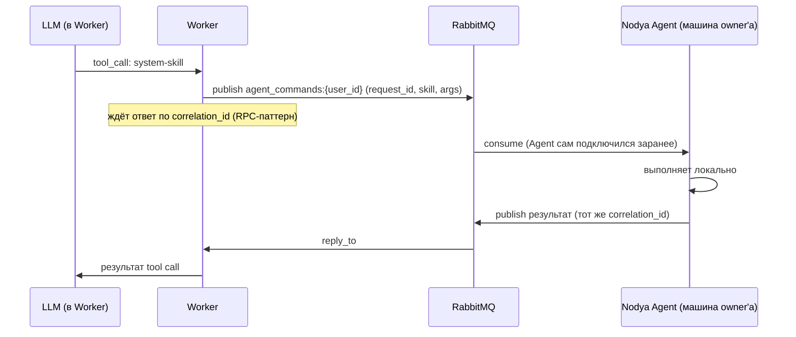

# Nodya — аудит архитектуры и дорожная карта разработки

Источники анализа:
- репозиторий `Sh1yden/Nodya` (ветка main, единственный коммит "Init structure of project...")
- три страницы твоих заметок в tldraw: `Main`, `User Flow`, `DATABASE`
- файл `Nodya_AI.tldr` — страница `Models and Skills`

Файлы tldraw читаются без проблем, конвертировать в svg/png не нужно.

---

## 1. TL;DR — главное

Проект на очень раннем этапе: слой данных (модели, репозитории, конфиг, логгер, alembic) сделан аккуратно, но:

1. **Модель `Users` не рабочая** — `browser_id` и `cli_id` сделаны как `NOT NULL` self-referencing `ForeignKey("users.user_id")`. Вставить первого пользователя физически нельзя (курица-яйцо).
2. **`docker-compose.yml` ссылается на пустой `Dockerfile`** — сборка контейнера `app` упадёт.
3. **В compose нет RabbitMQ и векторного хранилища**, хотя вся архитектура (Producer-Consumer, очереди `incoming_messages`/`outgoing_messages`) строится вокруг RabbitMQ.
4. **В `pyproject.toml` нет FastAPI, нет клиента Telegram, нет SDK для LLM** — то есть зависимости покрывают только слой памяти, а не API/воркер/мозг.
5. Из спроектированной в заметках структуры (`api/`, `brain/llm_choice`, `brain/skills`, `worker.py`, `main.py`, `tests/`) в коде реально существует только `app/core` и `app/brain/memory + models + repositories`. Остальное — не начато.

Дальше — подробный разбор и последовательный план.

---

## 2. Состояние репозитория по модулям

| Модуль | Статус | Комментарий |
|---|---|---|
| `app/core/config.py` | ✅ готово | Pydantic Settings, `computed_field` для `postgres_url`/`redis_url` — сделано грамотно |
| `app/core/logger.py`, `logger_config.py` | ✅ готово | Кастомный логгер (консоль + JSONL-файл), но `root_prefix = "syncnode"` — не совпадает с именем проекта `nodya`, надо решить, опечатка это или старое название |
| `app/core/__init__.py` | ⚠️ мелкий баг | `all = [...]` вместо `__all__` — конструкция ничего не делает, мёртвый код |
| `app/brain/models/*` | ⚠️ есть критический баг | Структура таблиц в целом соответствует заметкам, но модель `Users` сломана (см. п.3.1) |
| `app/brain/repositories/*` | ✅ по большей части готово | `BaseRepo` — нормальный generic-репозиторий (get_by_id, get_by_field, add, delete, update). `HardFactsRepo.search_last_updated()` — пустой стаб |
| `app/brain/memory/long/database.py` | ✅ готово | Async engine + sessionmaker, пул на 20+10 — ок для старта |
| `app/brain/memory/short/redis.py` | ❌ не начато | Пустой файл. Ничего из слоя "state/context/lock" из заметок не реализовано |
| `app/brain/migrations` (alembic) | ✅ готово | `env.py` корректно настроен под async-движок, `target_metadata` подключены. Инициирующая миграция наследует баг модели `Users` |
| `app/brain/memory/init/prompts/*.md` | ❌ не начато | `ME.md`, `CREATOR.md`, `RULES.md`, `SLEEP.md` — пустые файлы-заглушки |
| `app/api/*` (chats: tg/ds/browser/cli) | ❌ не начато | Папки нет вообще |
| `app/brain/llm_choice` | ❌ не начато | Папки нет |
| `app/brain/skills` | ❌ не начато | Папки нет |
| `worker.py` | ❌ не начато | Файла нет |
| `main.py` | ❌ пусто | Файл создан, но пустой |
| `Dockerfile` | ❌ пусто | Файл создан, но пустой — при этом `docker-compose.yml` уже делает `build: .` |
| `docker-compose.yml` | ⚠️ неполный | Есть `app`, `postgres`, `redis` с healthcheck — сделано хорошо. Нет `rabbitmq`, нет векторного хранилища |
| `pyproject.toml` | ⚠️ неполный | Есть: aio-pika, alembic, asyncpg, pydantic(-settings), redis, sqlalchemy. Нет: fastapi, uvicorn, клиента Telegram, SDK для Gemini/OpenRouter, apscheduler, pytest/ruff |
| `tests/` | ❌ не начато | Нет вообще |
| `README.md` / `CHANGELOG.md` | ❌ фактически пусто | По одной строке |

---

## 3. Найденные проблемы по приоритету

### 3.1 Критические (блокируют дальнейшую разработку)

**Баг в модели `Users`.**
```
browser_id: Mapped[UUID] = mapped_column(Uuid, ForeignKey("users.user_id"), nullable=False)
cli_id: Mapped[UUID] = mapped_column(Uuid, ForeignKey("users.user_id"), nullable=False)
```
Это self-referencing внешний ключ, причём `NOT NULL`. Вставить первую строку в таблицу `users` невозможно в принципе — SQLAlchemy/Postgres потребует, чтобы `browser_id` уже ссылался на существующего пользователя, а его ещё нет. Похоже на copy-paste из `HardFacts`/`AuditLogs`, где `user_id` действительно должен быть FK на `users.user_id` — но `Users` не может ссылаться сама на себя таким образом.

Судя по заметке *"В бд свой uuid делать. Не привязывать к tg или ds"* и по флоу *"Достаём через UsersRepo tg_id → по нему ищем уже внутренний user_id"*, задумка была другая: `user_id` — внутренний identity, а `telegram_id`/`discord_id`/`browser_id`/`cli_id` — это просто внешние идентификаторы разных каналов, по которым ищем внутреннего пользователя. Они не должны быть FK вообще.

**Решение (обновлено под multi-tenant).** Telegram/Discord выдают идентификатор извне — оставляем как есть, обычными nullable-полями на `Users` (`telegram_id`, `discord_id`), аккаунт создаётся автоматически при первом сообщении. Browser и CLI — самописные клиенты без внешнего identity-провайдера, значит нужна настоящая регистрация:

`Users` дополняется:
- `username`/`email` (unique) — вход через browser/cli
- `password_hash` (argon2id, не bcrypt)
- `role`: `owner` | `user` — разделение тебя как создателя и остальных пользователей деплоя

`AuthTokens` — как и раньше, но теперь per-real-user, а не под единственного владельца:
- `token_id` (PK), `user_id` (FK), `client_type` (`browser`|`cli`), `token_hash`, `created_at`, `last_used_at`, `revoked_at`

Флоу: `POST /auth/register` (email/username + пароль) → hash → строка в `Users` с `role=user`. `POST /auth/login` → проверка пароля → opaque-токен, хэш в `AuthTokens`, plaintext уходит клиенту один раз. Резолв на рантайме одинаковый для всех каналов: конечная точка — `user_id`, которым везде ниже партиционируется память (Redis/Postgres/Qdrant). Opaque-токен вместо JWT — монолиту с одним инстансом не нужна stateless-верификация, а хэш в БД даёт мгновенный отзыв без доп. инфраструктуры.

Регистрация — открытая, без инвайт-кодов (решено).

**Пустой `Dockerfile` при `build: .` в compose.** Сборка сервиса `app` упадёт на первом же `docker-compose up`.

### 3.2 Важные (нужно решить до перехода к MVP)

- В `docker-compose.yml` нет RabbitMQ — а весь message flow (webhook → `incoming_messages` → worker → `outgoing_messages`) физически не может работать без брокера. `aio-pika` в зависимостях уже есть, инфраструктуры под него — нет.
- Не решён вопрос векторного хранилища: в заметках прямым текстом написано, что отдельный Qdrant — оверинжиниринг, и предпочтительный prod-ready вариант — расширение `pgvector` внутри уже существующего PostgreSQL. Рекомендую зафиксировать это решение сейчас, а не откладывать — это решение сильно влияет на модели, репозитории и docker-compose.
- В `pyproject.toml` отсутствует FastAPI (нужен для API Gateway) и клиент Telegram (aiogram или чистый aiohttp под webhook).
- Не выбран SDK для обращения к Google AI Studio / OpenRouter — без него `brain/llm_choice` не с чего начинать.

### 3.3 Мелкие (technical debt, не блокируют)

- `all = [...]` в `app/core/__init__.py` → должно быть `__all__`.
- Название `root_prefix = "syncnode"` в логгере не совпадает с именем проекта `nodya` — либо старое название, либо опечатка, стоит унести в `settings`.
- `HardFactsRepo.search_last_updated()` — пустой метод без реализации и без docstring с намерением.
- `.env.example` отсутствует в репозитории — при этом `docker-compose.yml` требует переменные `POSTGRES_USER/PASSWORD/DB`, `REDIS_*` и т.д. Без примера файла проект не поднимется "из коробки" у другого человека (или у тебя на новой машине).

---

## 4. Целевая архитектура (систематизация твоих заметок)

### 4.1 Поток данных — основной цикл (Telegram)



### 4.2 Жизненный цикл приложения (5 фаз — из твоих заметок, сведено в таблицу)

| Фаза | Триггер | Что происходит |
|---|---|---|
| 1. Bootstrap | `docker-compose up` | Старт FastAPI → alembic-миграции → healthcheck PG/Redis/RabbitMQ(/pgvector) → fail-fast при недоступности любого → регистрация Skills Registry → открытие consumer-соединения с RabbitMQ |
| 2. Active Loop | Сообщение в `incoming_messages` | Consumer берёт задачу → lock в Redis → state=`thinking` → сборка контекста (Qdrant/pgvector + Postgres + последние N сообщений из Redis) → system prompt → вызов LLM → при необходимости tool call → генерация ответа → публикация в `outgoing_messages` → unlock → state=`idle` |
| 3. Skills (фоновое восприятие) | Cron (APScheduler, ~30 мин) | Парсинг RSS/TG-каналов → фильтрация через Gemma с промптом релевантности → high score → проактивное сообщение в очередь; mid score → сохранение выжимки в векторное хранилище |
| 4. Consolidation (сон) | Раз в сутки ИЛИ `last_active_at` > 3ч | Забор всех сообщений из `nodya:context:{user_id}` → тяжёлая модель извлекает факты (JSON) + семантические блоки → запись в Postgres/вектора → очистка Redis |
| 5. Graceful Shutdown | `SIGTERM` | API перестаёт принимать новые HTTP-запросы → consumer отписывается от очереди → таймаут (~30с) на завершение текущих задач и запись в БД → закрытие пулов соединений |

### 4.3 Актуализированная структура проекта

```
nodya/
├── app/
│   ├── core/            # config, logger — уже готово
│   ├── api/
│   │   └── chats/
│   │       ├── tg/      # webhook, отправка ответов
│   │       ├── ds/      # discord — после MVP на tg
│   │       ├── browser/ # после MVP
│   │       └── cli/     # после MVP
│   └── brain/
│       ├── llm_choice/  # абстракция провайдеров (Dialogue/CS/BP/VS роли)
│       ├── memory/
│       │   ├── short/   # redis.py: state, context, lock, debounce
│       │   ├── long/    # database.py — уже готово
│       │   └── init/prompts/  # ME.md, CREATOR.md, RULES.md, SLEEP.md
│       ├── models/       # уже готово (после фикса Users)
│       ├── repositories/ # уже готово
│       ├── skills/        # реестр скиллов с risk tier (safe/elevated/sandboxed/system) и проверкой роли
│       └── migrations/    # уже готово
├── worker.py
├── main.py
├── agent/                 # Nodya Agent — отдельный процесс, только у owner (см. 4.5)
│   ├── main.py
│   ├── skills/            # реальные host-level реализации (shell, fs, автоматизация)
│   └── pyproject.toml     # свои зависимости, не связаны с Core
├── shared/                # общий контракт: SkillRequest/SkillResult для RPC между app/ и agent/
├── tests/
├── logs/
├── Dockerfile
├── docker-compose.yml
├── pyproject.toml
├── .env / .env.example
└── README.md / CHANGELOG.md
```

### 4.4 Открытые вопросы — их стоит закрыть сейчас, до кодирования соответствующих частей

Часть решений уже зафиксирована, часть — ещё нет:

1. ~~Qdrant vs `pgvector`~~ — **решено: Qdrant.** Отдельный сервис в docker-compose, `qdrant-client` в зависимостях.
2. ~~Модель `Users` / identity для browser и cli~~ — **решено:** `Users` хранит только `telegram_id`/`discord_id`, browser/cli — через отдельную таблицу `AuthTokens` с токеном на клиент (см. п. 3.1).
3. **Fallback-модели через OpenRouter и локальные модели** — в заметках напротив `nvidia/nemotron-...` и локальных моделей стоят знаки "?". Нужно решить: это активный fallback (автопереключение при недоступности Google AI Studio) или просто список "на будущее". От этого зависит, нужен ли `llm_choice` с автопереключением уже в MVP, или это можно отложить.
4. ~~Регистрация свободная или по инвайт-коду~~ — **решено: открытая регистрация**, без инвайтов.

### 4.5 Модель деплоя и разграничение прав на skills

Nodya — не централизованный SaaS, а система, которую разворачивает себе тот, кто хочет ей пользоваться: один человек для себя или компания для команды на своём сервере. Это уже покрыто multi-tenant моделью `Users`/`AuthTokens`/`role` из п. 3.1. Отдельная проблема — skills, управляющие ПК (shell, файловая система, автоматизация хоста): это функциональность личного агента, а не то, что можно раздавать произвольным пользователям чужого деплоя.

Решение — классификация skills по risk tier прямо в реестре:

| Tier | Примеры | Доступ по умолчанию | Где выполняется |
|---|---|---|---|
| `safe` | диалог, память, чтение RSS | все пользователи | in-process |
| `elevated` | запись/чтение собственных данных пользователя | все, но строго в рамках своего `user_id` | in-process |
| `sandboxed` | произвольный код/shell "понарошку" | все (деплой может выключить) | эфемерный изолированный контейнер (`--network none`, read-only rootfs, лимиты CPU/памяти/времени), убивается после выполнения |
| `system` | shell, файлы, процессы — управление реальным хостом | только `role=owner`, и только если задеплоен Nodya Agent | Nodya Agent, отдельный процесс на машине владельца |

`sandboxed` — аналог песочницы кода как у Claude/ChatGPT: контейнер не имеет доступа ни к хосту, ни к другим пользователям, поэтому его можно безопасно раздавать всем на любом деплое. Нужны квоты на пользователя (CPU-время, wall-clock таймаут, дисковая квота), чтобы общий сервер компании нельзя было превратить в майнер или устроить на нём DoS.

Два независимых переключателя для `system`:
- **Деплой:** флаг `SYSTEM_SKILLS_ENABLED` в конфиге, по умолчанию `false`. Решает тот, кто поднимает инстанс.
- **Роль:** даже при включённом флаге `system`-скиллы доступны только `owner`, не другим пользователям того же деплоя.

Проверка `(user.role, deployment.system_skills_enabled, skill.tier)` обязана быть в коде реестра/исполнителя до вызова хендлера — инструкция в `RULES.md` не является границей безопасности, LLM можно спровоцировать её нарушить через сообщение пользователя. Каждый вызов `system`-tier скилла обязателен к записи в `AuditLogsRepo` с полными аргументами.

**Как Agent физически связан с Core.** Agent — не входной канал (как TG/browser), а исполнитель на другом конце tool-calling цикла. Направление другое: не пользователь → Core, а Core → Agent, когда LLM решает вызвать `system`-скилл. Инфраструктура для этого уже есть в стеке — переиспользуется RabbitMQ, без нового транспорта:



Agent сам подключается к RabbitMQ (не принимает входящих соединений) и слушает персональную очередь `agent_commands:{owner_user_id}`. Presence: Agent раз в N секунд обновляет `nodya:agent_online:{user_id}` в Redis с коротким TTL — Worker проверяет этот ключ перед отправкой команды, чтобы не подвешивать пользователя на полный RPC-таймаут, если ПК владельца выключен.

**Разделение кода.** Agent живёт не внутри `app/`, а рядом, на уровне корня репозитория — `app/` концептуально означает "то, что уезжает в один Docker-образ Core", и смешивать туда host-control библиотеки, которые не нужны мультитенантному деплою, не стоит:

```
nodya/
├── app/          # Nodya Core — деплоится на сервер (мультитенант)
│   ├── api/, brain/, worker.py, main.py, ...
├── agent/        # Nodya Agent — отдельный процесс, только у owner
│   ├── main.py
│   ├── skills/    # реальные host-level реализации
│   └── pyproject.toml   # свои зависимости, не связаны с Core
├── shared/        # общий контракт: схемы SkillRequest/SkillResult для RPC
└── ...
```

`shared/` нужен, чтобы Agent не импортировал напрямую из `app.brain...` и не тянул за собой весь стек зависимостей Core (FastAPI, SQLAlchemy, Qdrant-клиент) ради одной схемы сообщения.

---

## 5. Roadmap — последовательные этапы

Чекбоксы этапов 0–11 с контрактами каждой функции/класса (что принимает, что возвращает) вынесены в отдельный файл — **`Nodya_roadmap_todo.md`** — чтобы не раздувать этот документ дальше. Здесь остаётся только список этапов для навигации:

0. Фикс того, что уже сломано (Users, AuthTokens)
1. Инфраструктурный фундамент (Docker, RabbitMQ, Qdrant)
2. Redis-слой памяти (state/context/lock/debounce)
3. API Gateway (FastAPI: webhook, регистрация/логин, health)
4. Worker: основной цикл
5. LLM-слой + skills registry (risk tier, sandbox)
6. Ответ пользователю
7. Проактивное поведение и фон (background parser, consolidation)
8. Надёжность (graceful shutdown, retry)
9. Тесты и документация
10. Остальные каналы (Discord, browser, CLI)
11. Nodya Agent (опционально, PC-доступ владельца)

---

## 6. Что делать прямо сейчас (первые 3 шага)

1. Исправить `Users` (этап 0) — без этого любая вставка пользователя роняет приложение.
2. Написать `Dockerfile` и добавить `rabbitmq` в compose (этап 1) — иначе `docker-compose up` не поднимет то, что уже есть.
3. Зафиксировать решение Qdrant vs `pgvector` — это решение аффектит модели, репозитории и compose сразу в нескольких местах, откладывать его дальше дорого.
